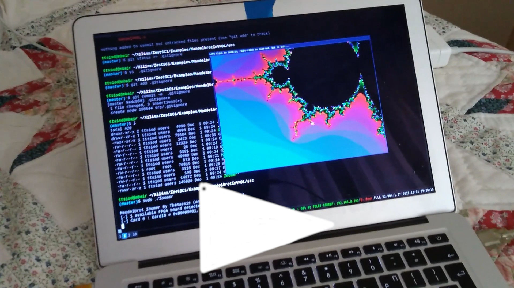
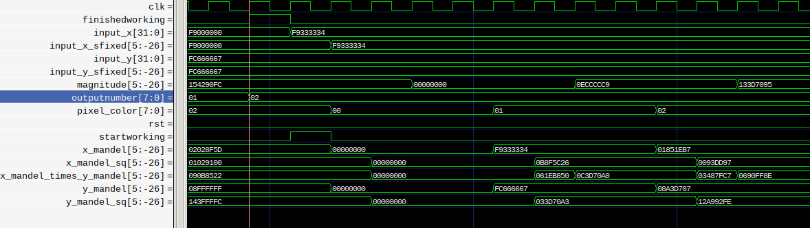
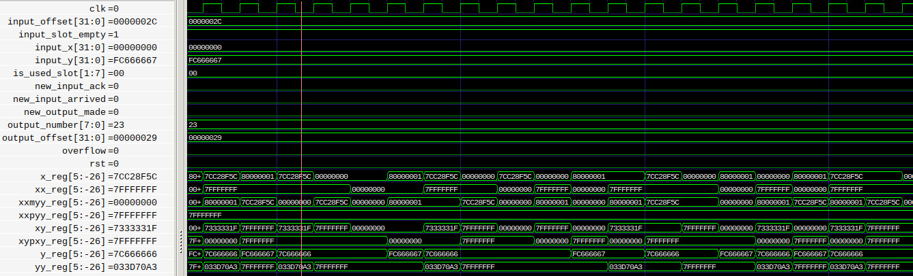

I *really* need to blog about this...

This project is basically my gateway into actually learning VHDL.
I've already succeeded in implementing a straightforward "C-to-VHDL"
translation of the algorithm, with the HW side fully implementing the
computation of a complete frame, storing it in SRAM, and then sending it
back to the main PC over the USB bus.

<a href="https://www.youtube.com/watch?v=yFIbjiOWYFY">
Mandelbrot in VHDL - real-time zooming video</img></a>

Now I need to find the time... to try to pipeline this - so I can get
one pixel output per cycle.

**UPDATE, Jan 25th, 2021**: I found the time :-)

Basically, my original code "mirrored" every line of the mandelbrot C code
by conceptually turning each line into a state of the state machine:
[stage1](https://github.com/ttsiodras/MandelbrotInVHDL/blob/master/FPGA-VHDL/Mandelbrot.vhd#L82),
[stage2](https://github.com/ttsiodras/MandelbrotInVHDL/blob/master/FPGA-VHDL/Mandelbrot.vhd#L93),
etc.

But what I really wanted, was to make this pipelined - i.e. to find a way
to use the power of HW to perform things **simultaneously**.

The first step towards this goal, was to write a complete simulation - using
the excellent open-source GHDL simulator. I did this inside the
[branch "GHDL simulation"](https://github.com/ttsiodras/MandelbrotInVHDL/tree/GHDL_simulation).

Running...

    make simulation

...the testbench code inside `GHDL/tb/mandel_tb.vhdl` will compare 89 outputs
from the C version of the algorithm, with those from the HW version.
They will match; and in addition, it will report:

    tb/mandel_tb.vhdl:216:5:@644010ns:(assertion note): Successful end of test

That is, the computation of these 89 points on the complex plane of the
Mandelbrot set, took 644.01 microseconds.

 
<em>The naive, SW-like implementation</em>

`make waves` records a VCD trace from GHDL, and launches GTKWave on it,
allowing us to see what happens with the signals. Notice the "empty space",
as many signals stay idle - while each stage of the state machine processes
its inputs and generates its outputs.

Basically, this is how our CPUs work - instruction by instruction.

But in the ["GHDL simulation pipelined" branch](https://github.com/ttsiodras/MandelbrotInVHDL/tree/GHDL_simulation_pipelined/),
things change - when we do `make test` here, we see this:

    [TB] Received test result of 240, passing test 89 / 89
    tb/mandel_tb.vhdl:178:9:@177060ns:(assertion note): Successful end of test

That is, instead of 644.01us, the new circuit takes 177.06us **to do the same work**.

In other words, it is 3.63 times faster. Why?

 
<em>The pipelined implementation</em>

Because there is no "empty space" anymore :-)

We are not like a CPU anymore - we are a proud, pipelined HW circuit.

Basically, the 3 multipliers involved in the Mandelbrot computation are almost
constantly kept busy - they never stop unless the pipeline is empty. As long as
we keep feeding the engine with inputs, they are doing work on every cycle - as
opposed to the serial version, that only uses them in the first two stages.
Same for the adders that follow - etc.

To be honest, writing this code was much harder than I expected... I am very happy
I finally figured it out.

And I now fully appreciate [GHDL](https://github.com/ghdl/ghdl); I couldn't have
fixed my VHDL code without it. The graphical representations alone (shown above
via `make waves") are not enough when you track down "race conditions" in HW signals.

OK, next step: run this in the Spartan3, and witness the 3x speedup with my
own eyes :-)
